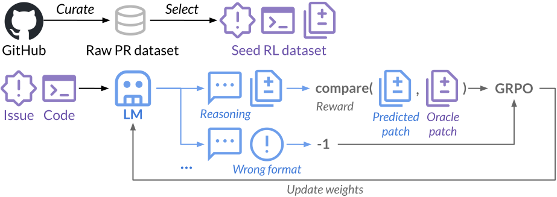
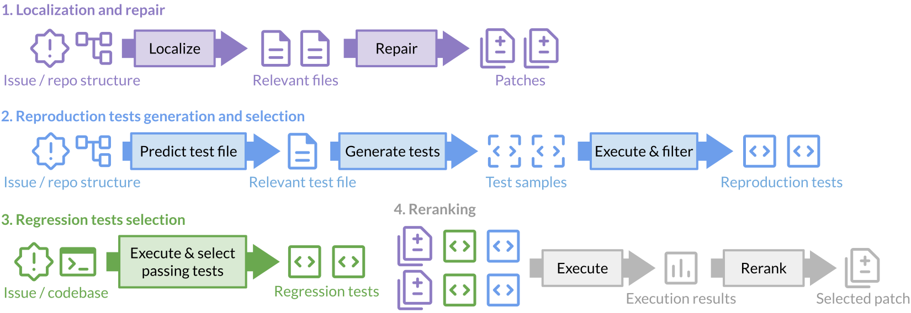

# SWE-RL

<p align="left">
    <a href="https://arxiv.org/abs/2502.18449">
</p>

<p align="left">
    🧐&nbsp;<a href="#-about">About</a>
    | 🚀&nbsp;<a href="#-quick-start">Quick Start</a>
    | 🐣&nbsp;<a href="#-agentless-mini">Agentless Mini</a>
    | 📝&nbsp;<a href="#-citation">Citation</a>
    | 🙏&nbsp;<a href="#-acknowledgements">Acknowledgements</a>
</p>

## 🧐 About

Official codebase for our paper: **SWE-RL: Advancing LLM Reasoning via Reinforcement Learning on Open Software Evolution** ([link](https://arxiv.org/abs/2502.18449)).

**SWE-RL** is the first approach to scale reinforcement learning based LLM reasoning for real-world software engineering, leveraging open-source software evolution data and rule-based rewards.



> [!NOTE]
> We have undertaken significant code refactoring to enhance quality and accessibility. However, this may introduce potential inconsistencies with our internal implementation. If you encounter a bug, please file an issue. We are also gradually updating the repo to include additional information.


## 🚀 Quick start

```bash
git clone https://github.com/facebookresearch/swe-rl && cd swe-rl
pip install -e ".[dev]"
pytest
```

The code currently provides our prompt templates and the implementation of the reward function based on sequence similarity.
You can find them in [src/swerl/core/prompts.py](src/swerl/core/prompts.py) and [src/swerl/core/reward.py](src/swerl/core/reward.py) respectively.

A toy example on how you can use the reward function in your own project:

``````python
import swerl

file = """
def sort_list(lst):
    return sorted(lst)
""".strip()

oracle_file = """
def sort_list(lst: list[int]) -> list[int]:
    return sorted(lst)
""".strip()

context = {"example.py": file}
oracle = {"example.py": oracle_file}

output = """
<think>
...thoughts by LLM
</think>
<solution>
```python
### example.py
<<<<<<< SEARCH
def sort_list(lst):
=======
def sort_list(lst: list[int]) -> list[int]:
>>>>>>> REPLACE
```
</solution>
""".strip()

reward, metadata = swerl.core.reward.calculate_search_replace_reward(context, oracle, output)
assert reward == 1.0
print(metadata)
``````

You can also check `swerl.core.reward.calculate_reward`, which is more general and can be paired with any editing format.

## 🐣 Agentless Mini



The code will be updated shortly.

## 📝 Citation

```bibtex
@article{wei2025swerl,
  title={SWE-RL: Advancing LLM Reasoning via Reinforcement Learning on Open Software Evolution}, 
  author={Yuxiang Wei and Olivier Duchenne and Jade Copet and Quentin Carbonneaux and Lingming Zhang and Daniel Fried and Gabriel Synnaeve and Rishabh Singh and Sida I. Wang},
  year={2025},
  journal={arXiv preprint arXiv:2502.18449}
}
```

## 🙏 Acknowledgements

[Agentless](https://github.com/OpenAutoCoder/Agentless),
[SWE-Gym](https://github.com/SWE-Gym/SWE-Gym),
[SWE-Fixer](https://github.com/InternLM/SWE-Fixer),
[SWE-bench](https://github.com/SWE-bench/SWE-bench),
[Moatless EvalTools](https://eval.moatless.ai/),
[Neubius SWE-agent](https://nebius.com/blog/posts/training-and-search-for-software-engineering-agents).

## License

SWE-RL is CC BY-NC 4.0 licensed, as found in the [LICENSE](LICENSE) file.
